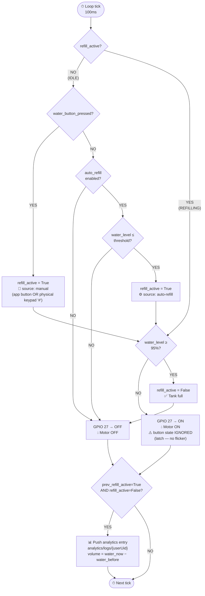
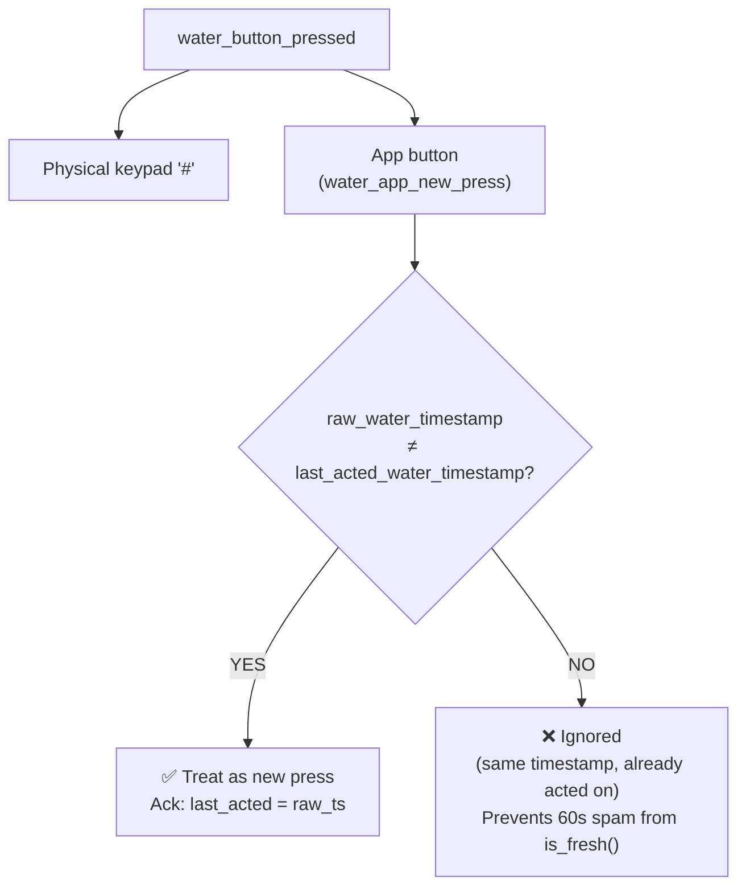
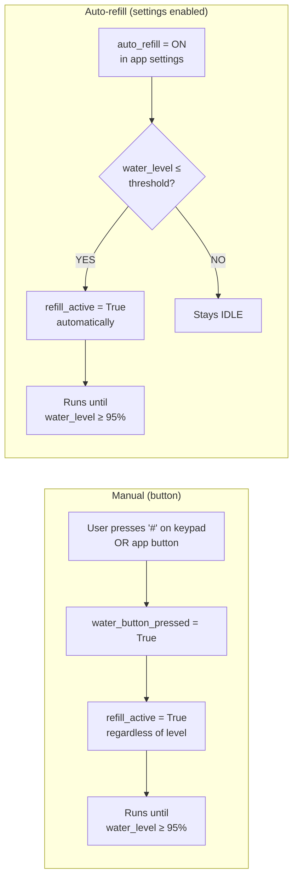

# REFILL_LOGIC.md
> Water Refill State Machine — `_refill_it()` in `process_b.py`
> Evaluated every **100ms**. GPIO 27 relay reflects `refill_active` each tick.

---

---

## Button Press Sources

`water_button_pressed` is True when **any** of these fire in the same tick:

---

## Auto-Refill vs Manual — Side by Side

---

## Key Constants

| Constant | Value | Meaning |
|---|---|---|
| `MAX_REFILL_LEVEL` | `95%` | Hard stop — refill always stops here |
| `current_water_threshold_warning` | user setting | Auto-refill triggers at or below this level |
| `is_fresh` window | `60s` | How long app button timestamp stays "active" |
| Loop tick | `100ms` | How often `_refill_it()` is evaluated |