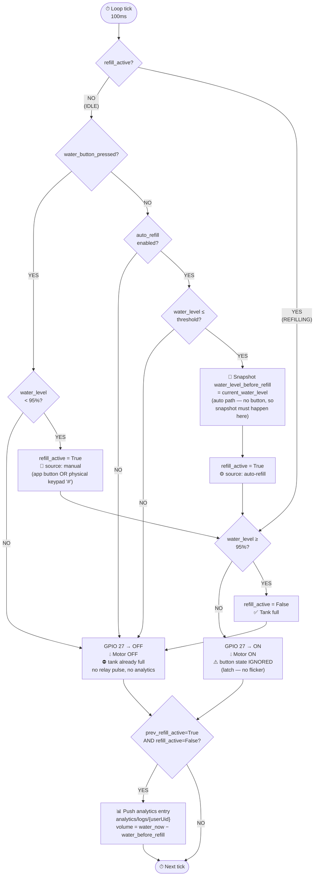
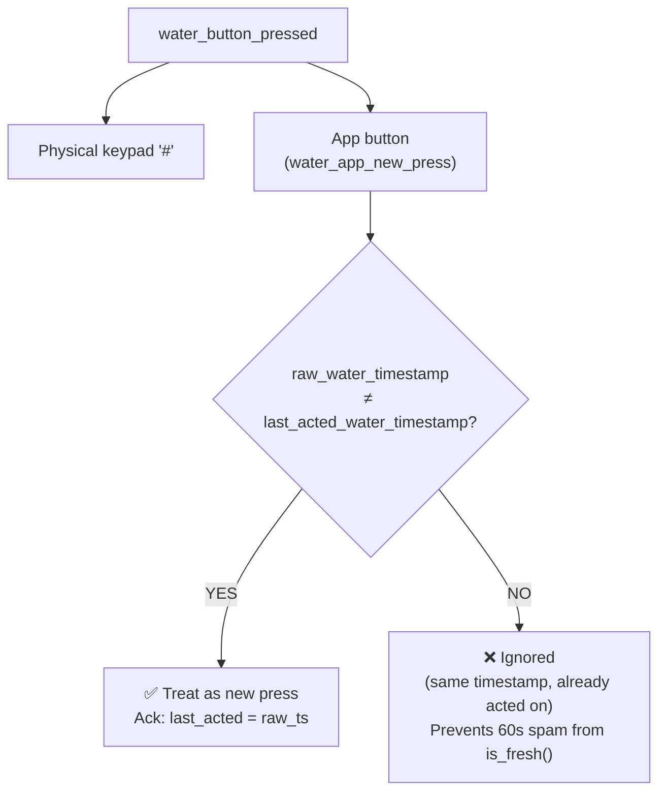
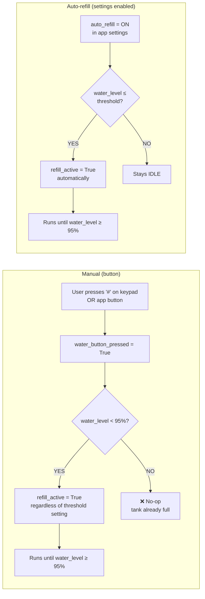

# REFILL_LOGIC.md
> Water Refill State Machine — `_refill_it()` in `process_b.py`
> Evaluated every **100ms**. GPIO 27 relay reflects `refill_active` each tick.

---

---

## Snapshot Timing — Manual vs Auto

```mermaid
flowchart TD

    subgraph MANUAL ["Manual button path"]
        M1["water_button_pressed = True\nAND refill_active = False"]
        M1 --> M2["📸 Snapshot BEFORE _refill_it\nwater_level_before_refill = current_water_level"]
        M2 --> M3["_refill_it → refill_active = True"]
        M3 --> M4["Refill runs...\nstops at 95%"]
        M4 --> M5["📊 analytics: water_now − snapshot\n✅ correct volume"]
    end

    subgraph AUTO ["Auto-refill path"]
        A1["water_button_pressed = False\nauto_refill = ON\nwater_level ≤ threshold"]
        A1 --> A2["📸 Snapshot BEFORE _refill_it\nwater_level_before_refill = current_water_level\n⚠️ must happen here — no button event to trigger it"]
        A2 --> A3["_refill_it → refill_active = True"]
        A3 --> A4["Refill runs...\nstops at 95%"]
        A4 --> A5["📊 analytics: water_now − snapshot\n✅ correct volume"]
    end

    subgraph BAD ["❌ Old bug (fixed)"]
        B1["Auto-refill starts"]
        B1 --> B2["No snapshot taken\nwater_level_before_refill = 0.0"]
        B2 --> B3["📊 analytics: water_now − 0.0\n❌ wrong volume"]
    end
```

---

## Button Press Sources

`water_button_pressed` is True when **any** of these fire in the same tick:

---

## Auto-Refill vs Manual — Side by Side

---

## Key Constants & Thresholds

| Constant | Value | Meaning |
|---|---|---|
| `MAX_REFILL_LEVEL` | `95%` | Hard stop — refill always stops here. Also guards manual start. |
| `current_water_threshold_warning` | user setting | Auto-refill triggers at or below this. Keep ≤ 80% to avoid short-cycling. |
| `is_fresh` window | `60s` | How long app button timestamp stays "active" |
| Ack gate | per-timestamp | One press = one action, regardless of `is_fresh` window |
| Loop tick | `100ms` | How often `_refill_it()` is evaluated |

---

## What Was Fixed

| # | Bug | Fix |
|---|---|---|
| 1 | Manual button started pump even when tank was already at 95%+ — caused 1-tick relay pulse and a `volumePercent: 0` analytics entry | Added `current_water_level < MAX_REFILL_LEVEL` guard on manual start path |
| 2 | Auto-refill could short-cycle if `water_threshold_warning` was set close to 95% | No code change — app-side settings should cap threshold at ~80% |
| 3 | Auto-refill never took a `water_level_before_refill` snapshot — analytics always logged wrong volume (`water_now − 0.0`) | Added explicit snapshot block for the auto-refill path before `_refill_it()` runs |